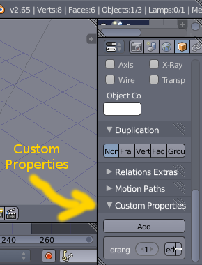

Exporting a model
=================

Wing Blender 2.0 adds many new features for exporting and customizing models.
Now, modders can export multiple models from one Blender file, and do even more
customization than what was previously possible.

Deciding what to export
-----------------------

Modders can now decide to export only the object they have selected, or every valid object in the scene root.

If the "Export only active object" option is enabled in the export menu, Wing Blender will only export the selected object and valid objects that are parented to either the active object, or one of its hardpoints.

If this option is not enabled in the export menu, every valid object in the scene root, and their children, and other valid objects that are children of their hardpoints will be exported.

In order for a model to be considered valid for export, it must meet these criteria:

1. All models must have a LOD 0 object.
2. All LOD objects for a particular model must be mesh or empty objects.
3. Each LOD object must be visible in Blender's viewport.
4. All LODs of the model must be named `detail-X`, `detailX`, or `Y-lodX`,
   where X is the LOD level of the object, and Y is the name of the object.
5. All LODs of the model must have the same parent.

Model LOD detection
-------------------

If you choose to export only the active object, the active object's name will be
checked to see if it has a `detail-x` or `Y-lodX` name scheme. If it does, it is used
as the corresponding LOD for the respective model. If it does not, it is used as
the LOD 0 object, and any other objects matching its name, but suffixed with `-lodX`
are used as its LODs.

Note that the `detailX` and `detail-X` naming schemes are deprecated, and can
only be used once per object hierarchy. If this name scheme is used at all, it
will override the position of the export filename in the exported model filenames.

For example, if you have `detail-0` as the child of `duhiky-lod0`, the exported model
for `detail-0` will be named `duhiky_Mything.iff`, whereas it would otherwise be
named `Mything_foo.iff` if the object named `detail-0` had been named `foo-lod0`.

Customizing Model Metadata
--------------------------

There are several customizations you can make to your model using empty objects
parented to LOD objects and object custom properties.

### LOD Ranges ###
To customize the range that a particular LOD is visible at, you can either:

1. Make an empty object named `drange=X`, where X is the range, and parent it
   to the LOD that the range should apply to, or:

2. You can add a custom property named `drange` to the LOD object, with its
   value being the range.

A few things to note:

1. If you are using an empty `drange` object, and the LOD range has a decimal
   point, remember to replace the point with a comma! For example, the name
   of a LOD range object where the LOD range is 300.5 should be `drange=300,5`.

   I've set things up this way because Blender likes to stick `.000` or `.001`
   at the end of the names of objects with conflicting names. Any such suffixes
   are discarded.

2. You do not have to use a comma in place of the decimal point if you are using
   the `drange` custom property to set the LOD range for a particular LOD.

3. The `drange` custom property takes precedence over any LOD range objects that
   are parented to a particular LOD. So, if you have an object named `Duhiky-lod1`
   with both a `drange` custom property and a child object named `drange=300,5`,
   the value of the `drange` custom property will be used rather than the drange
   object.

### Center/Radius ###
The center and radius (CNTR/RADI chunks) of each LOD are also customizable. To
customize these metadata, make a spherical empty with a name starting with
`cntradi`, and parent it to the desired LOD object. The suffix of this object is
ignored.

The position of the `cntradi` object is used for the center position (CNTR chunk),
and the largest scale dimension is used for the radius (RADI chunk).

If no `cntradi` object is found, or the `cntradi` object is hidden, the center
and radius are calculated automatically.

### Hardpoints ###
Hardpoints are represented as empty objects named `hp-Y`, where Y is the name
of the hardpoint. To add a hardpoint, make a new empty object, name it `hp-Y`,
where Y is the name of the hardpoint. For example, if you want to make a hardpoint
named `gun1`, name your hardpoint object `hp-gun1`.

**NOTE**: Hardpoint names are case sensitive!
{: .alert.alert-warning }

Wing Blender will try to make the orientation of the hardpoint on the exported
model(s) match the orientation of your hardpoint object as closely as possible.
If you are using "Arrows" as the hardpoint object's display mode, the "Y" arrow
should match the forward orientation of the hardpoint, and the "Z" arrow should
match the upward orientation of the hardpoint.

Wing Blender also ensures there are no hardpoints with conflicting names on
the same model, and it will give you an error if it detects a hardpoint name
conflict.

Hardpoints from all LODs are included in the exported model(s). If a hardpoint
object is hidden, it will not be included in the exported model(s). Like
`cntradi` and LOD range objects, the numeric suffix is discarded.

### Collision Sphere ###
To give your model a custom collision sphere, make a spherical empty object named
`collsphr`, and parent it to any LOD object of your model.

Collision sphere objects parented to lower (more detailed) LOD levels will take
precedence over collision sphere objects parented to other LODs.

To disable a collision sphere, you can simply hide it in Blender's viewport.
